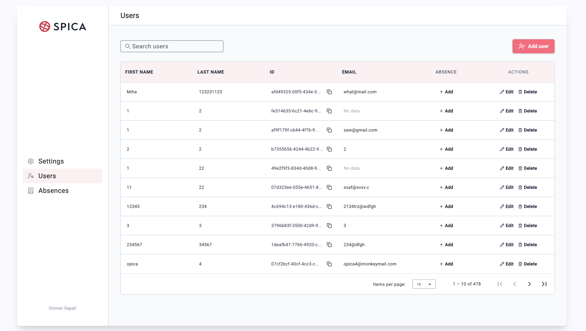

# Projekt Špica 



## Beforehand
Make sure you have **Node.js**, **npm** and **Angular CLI** installed! 

## Angular CLI 
```bash
npm install -g @angular/cli
```
## Cloning the repository
```bash 
git clone https://github.com/domensapac/spica.git
```
```bash
cd spica
```

## Installing dependencies
```bash 
npm install
```
## Starting local server 
```bash
ng serve
```

## Open application 
Visit http://localhost:4200 